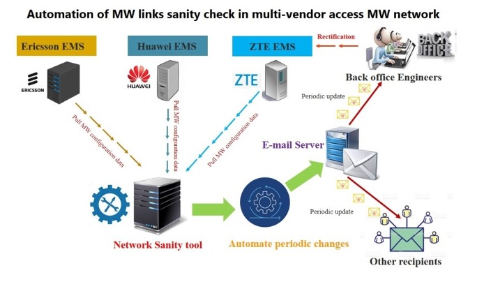

# Network Sanity Check
 
The process of network sanity check is a critical aspect for the smooth functioning of any technology platform. This involves a set of governance and systems engineering procedures aimed at monitoring and regulating network parameters within acceptable thresholds.

The key objective of the sanity check process is to identify and monitor individual configuration items. By utilizing an automated tool for this process, a network can ensure that the desired configuration state is maintained and any configuration anomaly is detected and reported in a timely manner.

Why is network sanity check important? 
* It helps to minimize the risk of outages by providing visibility and tracking changes to system parameters.
* By rapidly identifying and correcting improper configurations, it improves the experience for customers and internal staff and ensures that they are not impacted negatively by performance issues.
* The process also enforces formal policies and procedures that govern fault identification, status monitoring, and auditing, ensuring strict control of processes.
* It enables faster problem resolution and agility, leading to a higher quality of service and reduced software engineering costs.
* Additionally, by having a clear understanding of the baseline configuration and having visibility to redesign changes that avoid problems, network sanity check helps in efficient change management.
* Finally, in an outage, a quicker restoration of service is possible as the configuration is documented and automated.

